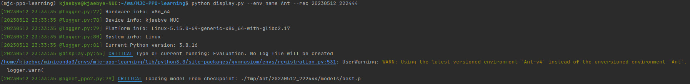
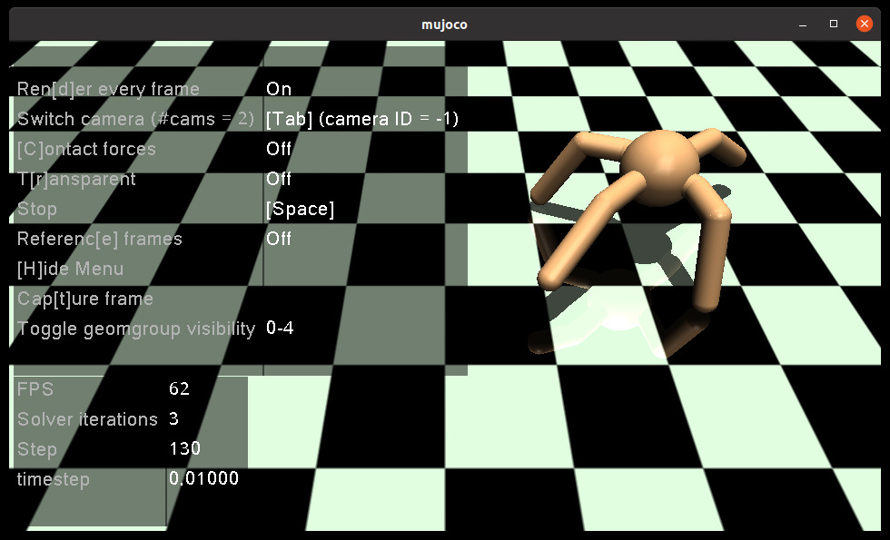
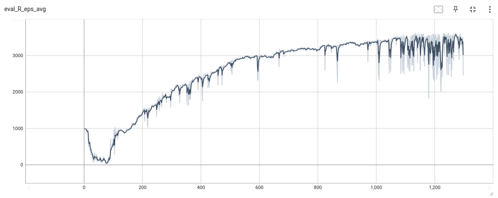

# Introduction
This repo is for PPO learning.

### Brief description:
- RL algorithm kernal is wrapped in `/lib`
- PPO2 algorithm is wrapped in `/lib/agents/agent_ppo2.py`, containing networks definition and parameters updating.
- RL sampling part is wrapped in `/lib/agents/agent.py`, providing a multiprocessing method to sample data.
- Environment making is wrapped in `/lib/general_agent.py`

### Some features are realised:
- Using formatted logger makes better visualization and data monitoring.
- Using .yml config file to manage hyperparameters.
- Using tensorboard module for supervision.

----
# Folder Structure

`/config` directory include settings .yml files for training, located at **/config/cfg**. Besides, **get_args.py** 
parses commands from terminal, **config.py** loads .yml files.

`/utils` includes formatted logger, and other useful modules but less related to RL core algorithm.

`/lib` includes all RL related core modules.

`/tmp` is the logging file directory, including log file, saved models, and `/tb` directory.

> Please note that: results are generated in **/tmp** in default.
----------------------

# Usage
Train from scratch:
```commandline
python train.py --env_name Ant
```
Evaluation and visualization:
```commandline
python display.py --env_name Ant --rec 20230512_222444 --iter best
```


----------------------
# Configuration
The project is based on the Gymnasium and MuJoCo official python bindings.
Just run `train.py` and use pip install missed packages.

# Results
Ant:
